# 1.Process Concept

一些def:
* 进程 = 正在执行的程序
* 批处理系统中叫 job，分时系统中叫 user program 或 task。
* 进程执行必须顺序推进


process includes:
* program counter
* text section：代码
* stack section：函数参数、局部变量、返回地址
* data section：全局变量
* heap section：动态分配的内存(C中malloc出来的那种)

data section可分为:
* uninitialized
* init:在可执行文件中要存初始值

process in memory belike:

* 最底下是0地址，向上增大.最顶上是maxVA(图中展示的是virtual addr)
* Hole:中间没被占用的VA


若一个进程有多个thread：
* 进程是资源分配单位，线程是调度单位
* 每个thread有自己的PC，以及自己的私有栈（蓝色框）。
  * 每个thread是异步的，要各管各的局部变量
  * 私有栈一开始划分的时候就是互不重叠的
* 多个thread共享 text,data,heap section
  * 图中uninit和init组成data section
* library mappings：
  * 动态链接器将用到的库从disk中load进进程的VAS，并用`mmap`映射到某段地址。


quiz解析
Q4
* VAS是分配给进程的，而非线程。也就是说，同一进程内的所有线程共用一块内存
* 一个进程只有一块global data segment
Q5
* kernel code会在中断上下文（异步）或进程上下文（同步）中execute
Q6 为何收到I/O请求之后不能直接进ready，而要先waiting?
* 因为在等待同步的I/O操作完成。而相对于处理器来说，I/O很慢
* 若先进入ready queue中并且被scheduler选中了，就跑不了
* 会在wait-queue中等待



## 补充：kernel code 的两种执行上下文

也就是讨论：process和kernel的关系？


* VAS:virtual addr space

kernel code进入时有两种上下文(context)：
* process context(进程上下文)：进程通过sys call陷入kernel
  * 但是此时并非启动了一个kernel process，依旧属于原来的进程。
  * 只是从user mode切换成了kernel mode
* interrupt context(中断上下文)：由中断触发，不在任何进程上下文中
  * 它由硬件驱动，调用kernel中的ISR(其不属于任何进程)。
  * ISR是Interrupt Service Routine，中断服务例程

中断上下文优先级高于进程上下文，也就是说：
* 当硬件中断发生时，内核会暂停当前正在执行的进程上下文（无论是用户态还是内核态），优先去执行中断上下文（ISR）

进程上下文中还有一种kernel thread，是为了维护kernel正常运作的进程。不是从usermode过来的，而是完全在kernel mode之下

## 1.1 Process State

进程的状态：
* 新建(new)：正在创建进程
* 运行中(running)：正在执行指令
* 等待中(waiting)：进程正在等待某些事件的发生（如等待I/O操作完成）
* 就绪(ready)：等待被分配给一个处理器执行
* 已终止(terminated)：执行完毕

上述状态名称可以是任意的，且不同的 OS 可能有不同的名称，不过上述状态是所有 OS 共有的。
需要注意的是，**一个处理器核心在任意时刻只能运行一个进程**，所以很多进程会处于就绪或等待状态。

状态机：

* running中进程被外部信号中断：进入ready.因为没有等待I/O之类的操作

## 1.2 Process Control Block,PCB

PCB,一种表示进程的数据结构。又称任务控制块 (task control block)。如下图


>在linux中叫task_struct

* PCB存的是管理信息，而非process所用资源本身.
* 由kernel来进行PCB信息的更新

PCB包含很多关于特定进程的信息片段
* process state：前面说的那五个
* process number：进程号，唯一标识每个进程的号码。
* program counter：下一条指令的地址
* CPU registers:
  * 不同CPU架构的reg不同
  * 包括累加器、索引寄存器、栈指针、通用目的寄存器，以及任何的状态编码信息
  * 中断发生时要保存好这些reg的信息，后续用来恢复
* CPU-scheduling info:包括进程优先级、指向调度队列的指针，以及其他任何调度参数
* mem-management info:
  * base addr和limit reg：基址寄存器和界限寄存器。规定进程可用内存的起始地址和大小，起到内存保护的作用
  * page table或segment info
* accounting info(日志信息)：包括使用的 CPU 和实际时间、账户号码、作业或进程号等
* I/O status info:分配给进程的I/O设备表、打开文件列表

>system-call dispatch table(系统调用表)：存系统调用对应的syscall处理函数的指针。每次syscall时，根据调用号查表，调用syscall_dispatch_table[n]指向的处理函数。这张表是内核级的全局表
>Interrupt vector table(中断向量表)：一个数组，下标是中断号，每一项指向对应的 ISR（中断服务例程）的入口地址
>* 硬件触发某号中断时，CPU 拿中断号查这张表，跳到对应的 ISR 去执行。

## 1.3 Thread Control Block,TCB

线程管理块。

每个线程的PC、调度等信息不一样

一个PCB可以关联好几个TCB（如果是多线程的话）

## 1.4 CPU switch between PCBs

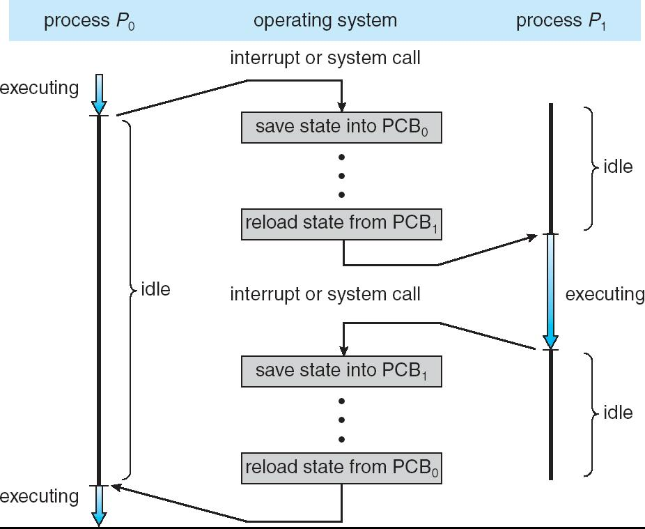

上图就体现了program counter的更新时机——context switch时

进程P0运行时发生了interrupt/sys call，跳到中间做别的事。然后scheduler挑出了P1来运行；
接着，P1也因同样的事释放了处理器，这时就save state。之后过了一段时间scheduler选出P0，此时就恢复它之前的上下文，接着执行即可


# 2.Process Scheduling

>切换时，kernel使用何策略挑选下个待运行进程？

依赖的data structure:
* Job queue
* Ready queue
* Device queue

## 2.1 Scheduling Queues,调度队列

### ready queue
* ready状态的进程的队列，以链表形式存储
* 队列头部是header，存储指向第一个PCB的指针
* tail指针：指向最后一个process


其实就是CPU queue.

### wait(device) queue

处于wait状态的进程，它在等什么设备，就会被放到那个相应的device-queue中。


见下图，下面那些就是device-queue
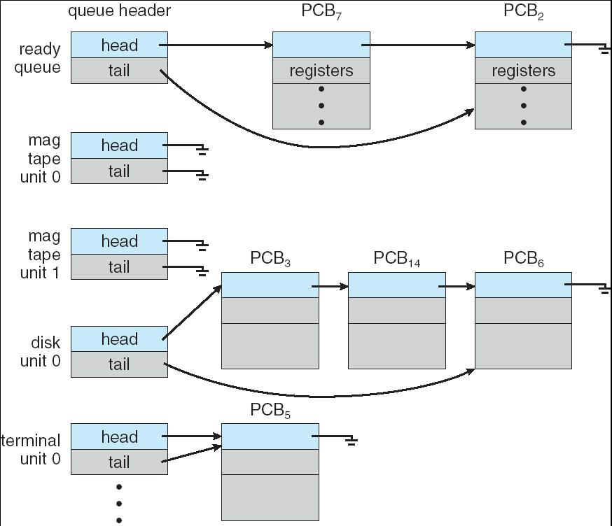

## 2.2 Representation of Process Scheduling

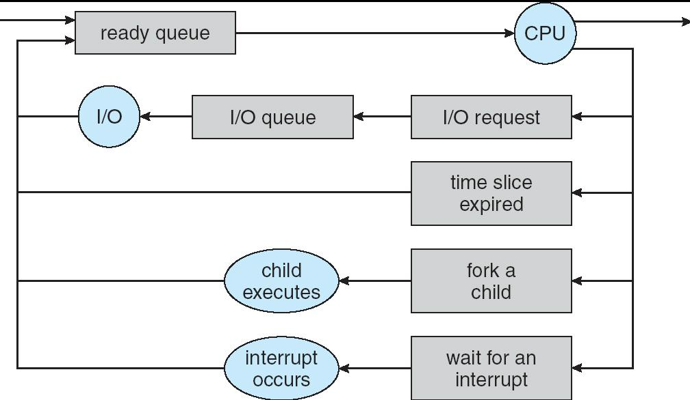

## 2.3 Schedulers

process scheduler是什么：
* 是一个program.

### scheduler分类

scheduler在哪运行：
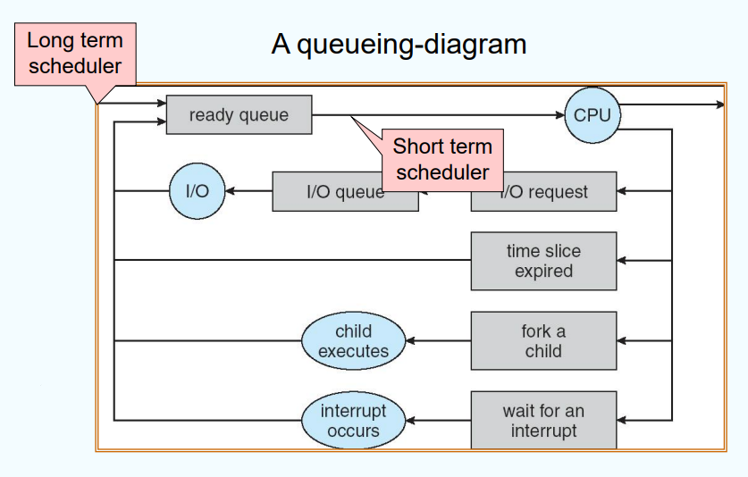
* long term：长期调度，选择哪些进程应该被admit进入memory(的ready queue)中
  * 交互式一般不用
  * 批处理时可能会用
  * 控制multiprogramming的degree：控制要不要把某程序load到mem中（degree是当前驻留在mem里的进程数量）
* short term:在ready queue中选择谁应该进入CPU
  * 平时谈论的一般都是short term
  * 也叫CPU scheduler
* medium term:在内存资源不足时，选择一些进程暂时从mem中“换出”(swap out)到外存中。反之swap in.见下图。
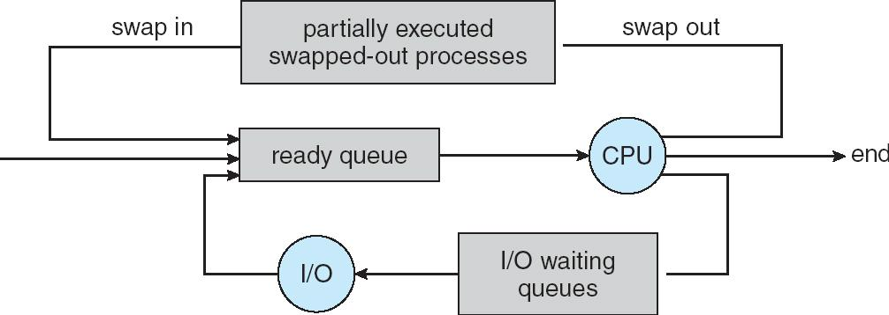

调度器与状态转移：

谁|做什么|状态变化
-|-|-
long-term|把新进程 load 进内存|new->ready
short-term|从 ready queue 挑一个进 CPU|ready->running
进程自己|发 I/O request|running->waiting
device|完成I/O|waiting->ready
medium-term|swap in / swap out|恢复/挂起

由于short-term被调用得很frequently，所以它必须很高速。

* 从一组可用的进程中挑选一个进程，放在某个处理器核心上执行。而 CPU 在一段时间内只能执行一个进程。
* 若进程数多于核心数，多出来的进程需要等到核心空闲后才能被重新调度。
* 当前**在内存中的进程数被称为多道程序的度(degree)**

### 进程分类

进程一般可根据I/O和计算时间占比分为：
* I/O-bound process:I/O 密集型进程，相比在计算上的时间，花在 I/O 上的时间更多
  * 如磁盘类操作
* CPU-bound process:CPU 密集型进程，生成 I/O 请求的频率较低，并且将更多时间花在计算上

CPU burst：一次连续纯计算的时间段。对于CPU-bound，CPU burst很长；另一个则很短


想提升CPU利用率，如何搭配不同类型的进程？
* 希望context switch的overhead(开销)能小一些。也就是说，要提高context switch的速率
* 由于CPU除saving/loading states之外没有执行对用户有帮助的work，所以这块被看作是纯overhead
* overhead:没用但无法避免的开销
* quiz补充：context switch并不会使中断的进程的PCB被永久deallocate from main memory。但是内存不够用时medium-term scheduler会把未完成的进程swap out到disk中


# 3.Operations on Processes

## 3.1 creation

>fork:产卵。--->创建子进程

创建子进程后，父子状态如下：
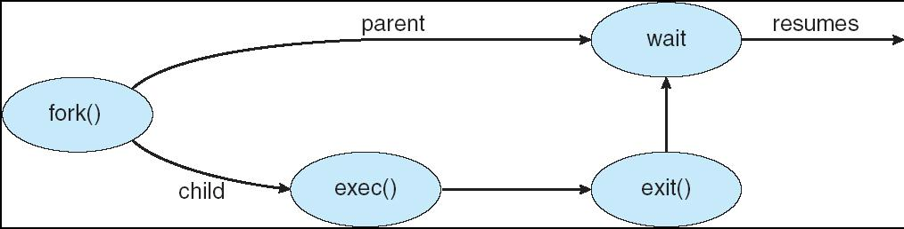

父进程和子进程的VAS长得一样。唯一的不同：返回的pid值
```c
int main() { 
  pid_t pid; /* fork another process */ 
  pid = fork(); 
  if (pid < 0){ /* error occurred */ 
    fprintf(stderr, "Fork Failed"); exit(-1); }
  else if (pid == 0) { /* child process */ 
    execlp("/bin/ls", "ls", NULL); }
  else { /* parent process */ 
    /* parent will wait for the child to complete */ 
    wait (NULL); 
    printf ("Child Complete"); exit(0); } 
}
```

fork()一次调用，父子进程看到不同的返回值：
进程|返回值
-|-
子进程|0
父进程|子进程的pid
fork失败（父进程看到）|-1

* 通过pid判断当前正在运行的是parent还是child进程
* 父子进程的内存空间完全一样，code也就一样，所以我们要根据pid的值判断当前是哪个进程
  * fork()刚返回的时候两者内存的内容完全一样
  * 但他俩是两份独立的副本，之后各自修改自己的内容，对方是看不见的
* 子进程从产生自己的那条fork()返回后的那条指令开始往下执行（先完成赋值）

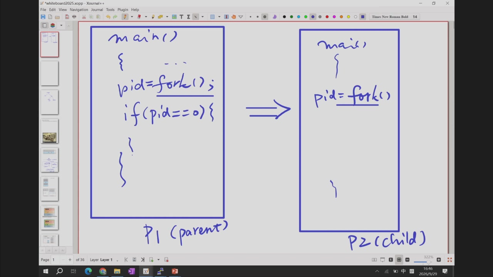

fork()产生的进程数：
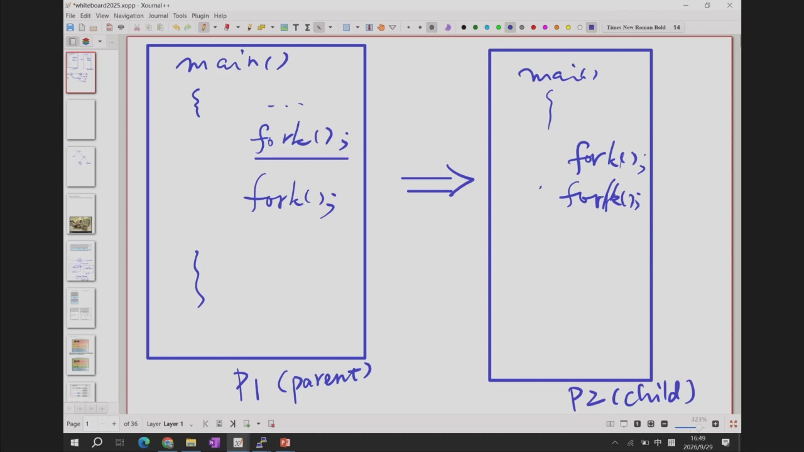
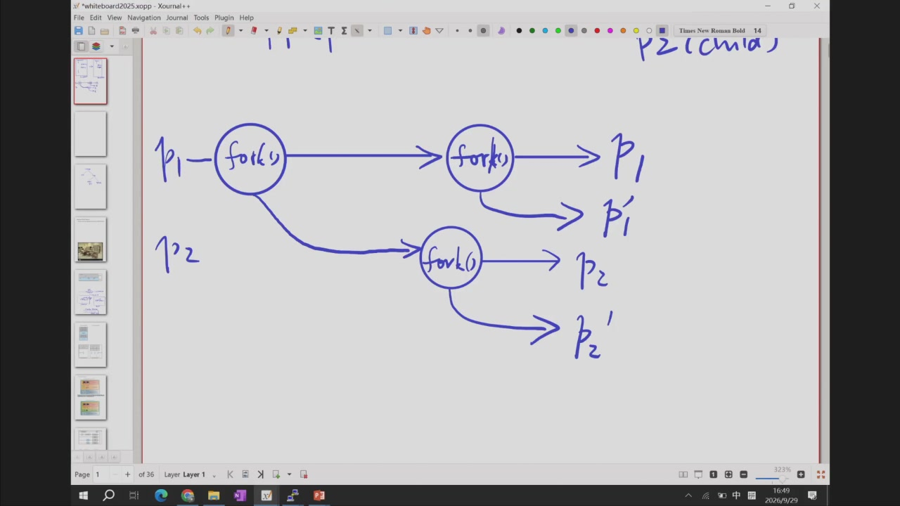

demo:运行外部进程，不再执行child原来的代码：
* 调用外部程序，会把当前进程的上下文(VAS,Virtual Address Space)覆盖掉。从而child就不执行了
* 孤儿进程：父进程结束后子进程的父亲会变成进程1，也就是parent_process_id变成1


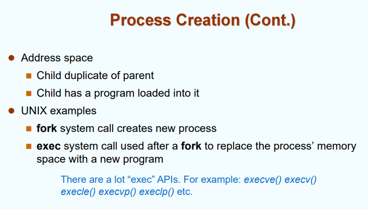
* UNIX中，fork()后，使用exec()可以用新程序替换掉当前进程的内存空间。从而直接开始运行新程序了
* fork()搭配exec()的用途：让子进程运行外部程序（不这么做的话，子进程就跟父进程一模一样，是duplicate的）
* 但进行exec()之后，这个进程的pid也不会变；所以依然保持着与父进程的父子关系和调度关系


创建进程后，有两种运行模式：
* 父子同时运行：若父亲先结束，儿子就直接成孤儿
* 父亲等待儿子运行完

## 3.2 Termination,终止

使用system call命令：exit
* 若其有父亲，父进程调用的wait就会返回，停止等待继续往下走
* 父进程可以终止子进程(abort())：
  * 子进程超出了可使用的资源
  * child的任务不再需要执行

# 4.Cooperating Processes

* Independent Process：不影响other process也不被影响的进程
* Cooperating Process：影响他人也可被影响的进程

进程合作的好处：
* 信息共享 info sharing
* 计算加速 computation speed-up
* 模块化 modularity
* 便利 convenience : 如copy-paste的方法

## 4.1 Producer-Consumer Problem，生产者-消费者问题

* 生产者生成信息，消费者消耗信息

为了让生产者进程和消费者进程能并发进行，他俩之间要有一个存放通信数据的buffer（这样消费者消费一个item时生产者可以生产另一个item了）

buffer可以分两类：
* unbounded buffer,无界缓冲区：空间无限大，不可能被填满
  * 理论上是没有无限大的，但是当这个具体问题中没有可能将其填满，buffer就可以看作无限大。
* bounded buffer,有界缓冲区：会被填满。这种情况更值得研究
* 他俩的key difference：unbounded的CPU不用等待

shared data:
```c
#define BUFFER_SIZE 10 
typedef struct { . . . } item; 
item buffer[BUFFER_SIZE]; 
int in = 0; int out = 0;
```

```c
//producer
//存数据。把buffer当作环状队列
while (true) {
 Produce an item;
 while (((in + 1) % BUFFER_SIZE == out))  //为了与in=out区分。这样会始终有一格空的
  ; /* do nothing -- no free buffers */
 buffer[in] = item;
 in = (in + 1) % BUFFER_SIZE;
 }
```

```c
//consumer
//取数据。
while (true) {
  while (in == out)
    ; //do nothing, nothing to consume

  Remove an item from the buffer;
  item = buffer[out];
  out = (out + 1) % BUFFER SIZE;
  return item;
 }
```

buffer共享，in/out也共享

buffer中最多存$BUFFER_SIZE - 1$个元素（为了区分empty和full这俩状态）

把buffer用满：
```c
while (true) {
  Produce an item;
  buffer[in] = item; //把这个放到while前
  while (((in + 1) % BUFFER_SIZE == out))  
    ; /* do nothing -- no free buffers */
    //buffer[in] = item;
  in = (in + 1) % BUFFER_SIZE;
 }
```

```
in|out|buffer
-|-|-
0|0|[A,0,0,0]
1|0|[A,B,0,0]
2|0|[A,B,C,0]
3|0|[A,B,C,D]

in|out|buffer
-|-|-
0|0->1|[A,B,C,D]->[0,B,C,D]
1|1->2|[0,B,C,D]->[0,0,C,D]
2|2->3|[0,0,C,D]->[0,0,0,D]
3|3(判断后卡住)|[0,0,0,D]
```

>进一步，引入count参数：表示buffer中元素数量。有潜在问题（同步）


linux中的pipes(管道)：
```bash
processA | processB  #A会作为信息的生产者，其输出的信息会流通到B
processA | processB | processC | ...  #可以级联。每个管道中流通的信息不同，主要取决于管道左端相邻的这个进程的output是什么
```

pipe操作很适合于处理表格数据。如把命令A的输出交给命令B，有点像数据库里面那种SQL expr
```bash
grep "Sales" employee.csv | cut -d',' -f2,4 | sort -t','
#把匹配的含Sales行数据交给cut，cut选出第2和4列交给sort
#在大规模数据中，cut不用等grep全处理完，选出来就直接往后流。是streamly的
```


# 5.IPC,Interprocess Communication

两种重要模型：message passing 和 shared memory

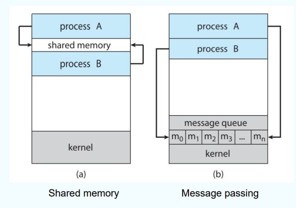

* 都是可以建立双向联络，也可以单向
* 对于shared mem
  * shared memory速度比message passing快。因为后者还要进行memory copy(读和写的时候都要)
  * mem mapping:进程共享同一块物理内存，但每个进程有自己的私有虚拟地址空间VAS。所以要通过页表映射，把这块物理内存同时映射进两个进程的VAS


```bash
// 进程 A
int fd = shm_open("/my_shm", O_CREAT | O_RDWR, 0666);
ftruncate(fd, 4096);
void *ptr = mmap(NULL, 4096, PROT_READ | PROT_WRITE, MAP_SHARED, fd, 0);
// ptr 就是映射后的虚拟地址，可以直接读写

// 进程 B
int fd = shm_open("/my_shm", O_RDWR, 0666);
void *ptr = mmap(NULL, 4096, PROT_READ | PROT_WRITE, MAP_SHARED, fd, 0);
// 进程 B 的 ptr 指向同一块物理内存
```
mmap 的关键参数：
* MAP_SHARED：共享映射，多个进程看到同一块内存。
* MAP_PRIVATE：私有映射，写时复制（copy-on-write）？？



* 对于msg passing
  * 为了收发message，需要在两进程间建立communication link
  * 为了标志双方，需要考虑naming的问题

## 5.1 msg passing

### 1 Direct Communication

**symmetric communication：** 通信的Processes必须显式地name each other
  * send(P,msg)：发给P
  * receive(Q,msg)：从Q收
**asymmetric communication：** 接收方事先不知道具体是谁发出的
  * send(P,msg)
  * receive(id,msg):id是一个输出的参数，从msg中解析并返回出来，表示发送者(id是pass by ref，给了一个地址/引用)
  * 这个比symmetric应用更普遍，因为它较为灵活

### 2 Indirect Communication

**mailbox(信箱)：** 进程间借助它进行通信。AKA *ports(端口)*
  * 每个mailbox有自己的id。进程间需要有shared mailbox才能通信
  * 可能有多个processes共用一个mailbox。此时可以群聊
  * well-known port：大家都知道、都用的port
  * 每对进程可能有多对communication links，每个link对应一个mailbox

mailbox的调度？如果有多个接收者，谁应该收到msg？

### Synchronization

msg passing可以是阻塞(blocking)/非阻塞(non-blocking)的
* Blocking
  * send: has the sender blocked until the message is received
  * receive: has the receiver block until a message is available
* Non-blocking
  * send: 发完就跑，继续干别的
  * receive: has the receiver receive a valid message or null

### Buffering

Indirect:不允许zero capacity buffer，因为mailbox至少要存一条信息
补充

## 5.2 shared memory

mmap
munmap


# 6.Communication in Client-Server Systems

没讲。也许略？